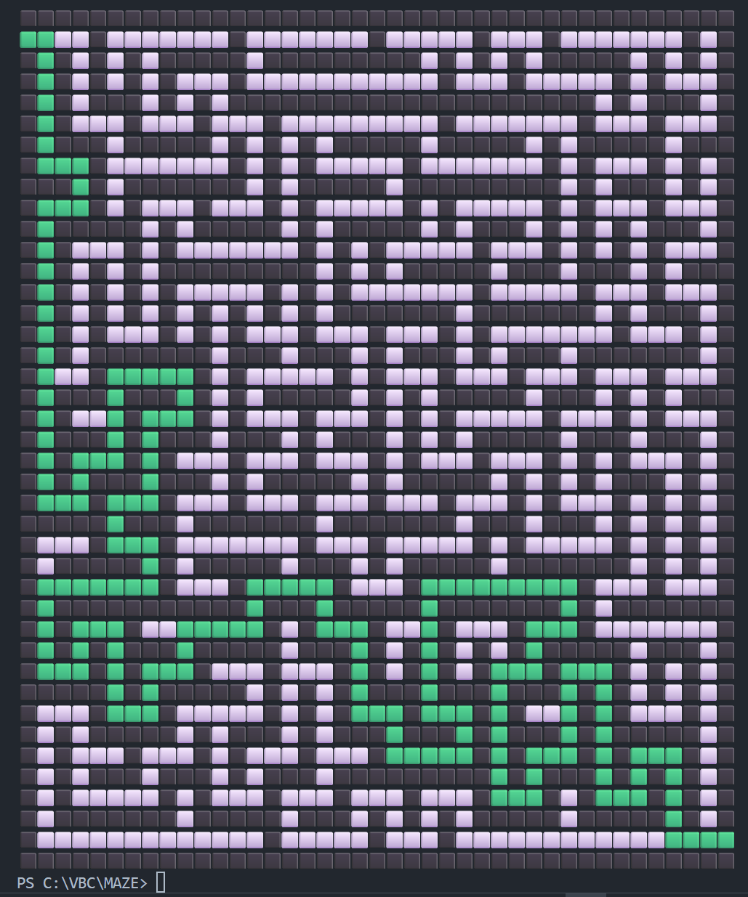
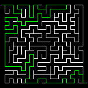

[README.md](https://github.com/user-attachments/files/22644709/README.3.md)
# Maze Solver in Python

This project implements a **maze solver** using Python, NumPy, and Pillow (PIL).  
It can take a maze image, preprocess it into a one-pixel-wide path, and then automatically find and visualize the solution — both in the **terminal** and on the **maze image**.

---

## Project Structure

```
.
├── Maze.py                 # Image-based solver (converts + solves maze)
├── MazeTerminal.py         # Terminal-based solver with ASCII output
├── MazePhoto.jpg           # Example maze input
├── MazePhotoTerminal_1.png # Terminal output (example 1)
├── MazePhotoTerminal_2.png # Terminal output (example 2)
├── MazePhotoTerminal_3.png # Terminal output (example 3)
├── TerminalMazeSolved.png  # Solved maze in terminal (screenshot)
├── ImageMazeSolved.PNG     # Solved maze in image form
```

---

## Features

- **Image Preprocessing**  
  Converts a raw maze image into a one-pixel-wide version using pixel averaging.  

- **Recursive Pathfinding**  
  Custom recursive algorithm that explores paths, creates nodes at junctions, and backtracks at dead ends until the exit is found.  

- **Terminal Visualization**  
  Uses ASCII/Unicode blocks to render the maze and highlight the solved path.  

- **Image Visualization**  
  Draws the solved path directly onto the maze image (in green).  

- **Flexible Sizes**  
  Works on different maze sizes (20×20, 40×40, 150×150, etc.).  

---

## Usage

### 1. Run the terminal solver
```bash
python MazeTerminal.py
```
This prints the maze and solved path in the terminal.

### 2. Run the image solver
```bash
python Maze.py
```
This opens the processed maze image with the solution highlighted in green.

---

## Recursive Algorithm (How It Works)

1. **Check Available Moves (Offsets)**  
   From the current pixel `(x, y)`, the algorithm checks up, down, left, and right.  

2. **Single Path (Corridor)**  
   If only one move is possible, it keeps walking automatically (no recursion needed).  

3. **Multiple Paths (Node Creation)**  
   If more than one move is possible, a **node** is created storing current state and possible directions. Each direction is then explored recursively.  

4. **Dead End or Exit**  
   If no moves remain → recursion ends.  
   If the exit is reached → the path is saved as a solution.  

---

## Examples

### Terminal Output


### Image Output


---

## Notes

- `Maze.py` → takes a raw image, converts it to a one-pixel maze, and solves it.  
- `MazeTerminal.py` → works with a one-pixel maze and displays it in the terminal.  
- All code and the recursive algorithm were built from scratch.  
- The recursive approach was first tested during my Chess Engine project and later refined here to solve mazes.

---

## Requirements

- Python 3.x  
- NumPy  
- Pillow (PIL)  

Install with:  
```bash
pip install numpy pillow
```

---

Ready to run both terminal and image maze solvers.  
